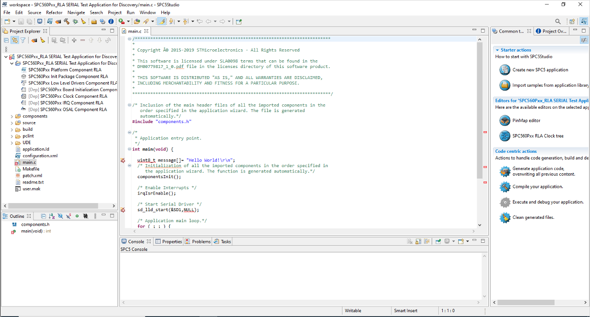
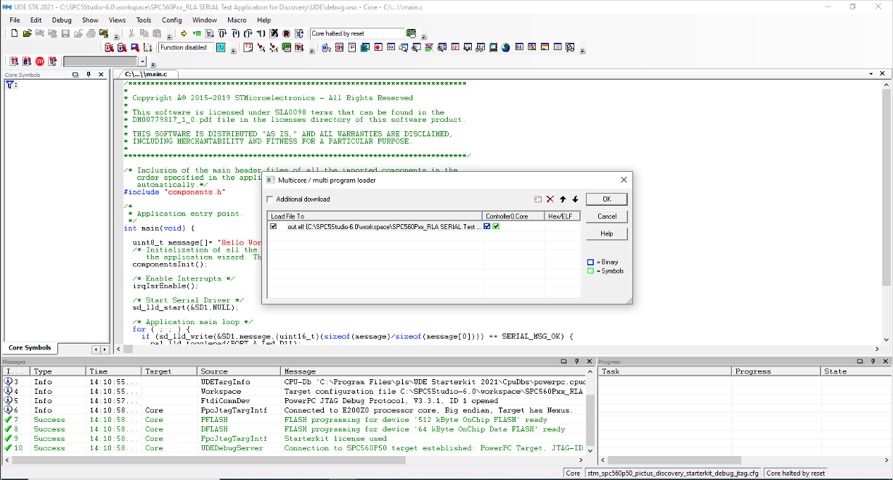

# Exercise 1 - Test Communications with an ECU

The goal of this exercise is to download and install the SPC5 Studio. This exercise starts with the student connecting the SPC560P development board to the PC. Once the student has connected the Board to the PC and powered the SPC560P Board on, then the student should download, install and execute the SPC5 Studio, and the Universal Debug Engine (UDE) onto their laptop using the following link.

* [The SPC5 Studio](https://www.st.com/content/st_com/en/products/development-tools/software-development-tools/spc5-software-development-tools/spc5-studio.html)
* [The Universal Debug Engine (UDE)](https://www.pls-mc.com/service/downloads/download-spc5-udestk/)
  * The software that you are looking to download and install is called "SPC5-UDESTK 2021.05 64Bit version"

Once the SPC5 Studio and Universal Debug Engine (UDE) then we can begin to develop and debug applications. When debugging applications you will need to get the Universal Debug Engine (UDE) to open the "debug.wsx" file located in the UDE directory within your workspace.
```
C:\SPC5Studio-6.0\workspace\SPC560Pxx_RLA SERIAL Test Application for Discover>dir
 Volume in drive C has no label.
 Volume Serial Number is 70FA-A8D5

 Directory of C:\SPC5Studio-6.0\workspace\SPC560Pxx_RLA SERIAL Test Application for Discover

21/01/2022  11:14    <DIR>          .
21/01/2022  11:14    <DIR>          ..
. . . . . . . . . . . . . . . . . . . . . . . . . .
21/01/2022  11:13    <DIR>          source
21/01/2022  21:29    <DIR>          UDE
21/01/2022  11:13               428 user.mak
              10 File(s)         92,353 bytes
               9 Dir(s)  724,143,259,648 bytes free

C:\SPC5Studio-6.0\workspace\SPC560Pxx_RLA SERIAL Test Application for Discover> cd UDE

C:\SPC5Studio-6.0\workspace\SPC560Pxx_RLA SERIAL Test Application for Discover\UDE>dir
 Volume in drive C has no label.
 Volume Serial Number is 70FA-A8D5

 Directory of C:\SPC5Studio-6.0\workspace\SPC560Pxx_RLA SERIAL Test Application for Discover\UDE

21/01/2022  21:29    <DIR>          .
21/01/2022  21:29    <DIR>          ..
21/01/2022  11:13            52,511 debug.wsx
. . . . . . . . . . . . . . . . . . . . . . . . . .
C:\SPC5Studio-6.0\workspace\SPC560Pxx_RLA SERIAL Test Application for Discover\UDE>

```
For the purposes of this Exercise download and open the following project SPC5 Studio and the Universal Debug Engine (UDE)

* [SPC560Pxx_RLA SERIAL Test Application for Discover](https://github.com/Merimetso-Code/EmbeddedAutomotiveSecurity/blob/main/EXERCISE1.zip)

Once you have download and open this file in SPC5 Studio then you should get the following:



And opening the 'debug.wsx' win Universal Debug Engine (UDE) should produce the following:



# Tips and Hints
Information and help on programming in C can be found on the following links:
* [Programming in C](https://beginnersbook.com/2014/01/c-program-structure/)
* [A C Tutorial](https://www.cprogramming.com/tutorial/c-tutorial.html?inl=nv)
* [Loops in C](https://www.tutorialspoint.com/cprogramming/c_loops.htm)

## Contact Details

For further information and questions please contact Dr Andrew Blyth, PhD. <ablyth@merimetso.net>
