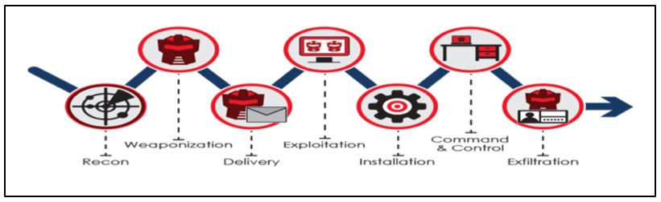

# Exercises 7 - Reverse engineering functionality and finding bugs (continued)

The goal of this excercise is to use the kill chain in analysing the software for the ECU and developing an exploit. The two stages that we are going to explore in this exercise are:

* Reconnaissance 
* Weaponization

So, to start with dowanload the compressed package and uncompress it.

* [Exercise 7](https://github.com/Merimetso-Code/EmbeddedAutomotiveSecurity/blob/main/EXERCISE5.7z)




This tutorial is structured in two parts. In the first part you are required to perform Reconnaissance on the softawre for the MPC5748G ECU, and the second part you will be required to validate the expliot. 

* Stage 1 - Reconnaissance
 ** Stag 1 begins with the analysis of the following code for processor Z4_0. Your analysis should focus on the main function. You are required to identify under what conditions an error/vulnerability can be triggered.
```
C:\Projects\flexcan_receive\flexcan_receive_Z4_0\src>dir
 Volume in drive C has no label.
 Volume Serial Number is 70FA-A8D5

 Directory of C:\Projects\Projects\flexcan_receive\flexcan_receive_Z4_0\src

06/08/2021  20:31    <DIR>          .
06/08/2021  20:31    <DIR>          ..
06/08/2021  16:22             5,997 can.c
11/11/2019  14:58             1,974 flashrchw.c
11/11/2019  14:58             2,965 intc_sw_handlers.S
11/11/2019  14:58            46,266 intc_SW_mode_isr_vectors_MPC5748G.c
06/08/2021  17:59             3,971 main_Z4_0.c
11/11/2019  14:58             3,758 mode.c
11/11/2019  14:58            10,623 MPC57xx__Interrupt_Init.c
11/11/2019  14:58             2,656 Vector.c
               8 File(s)         78,210 bytes
               2 Dir(s)  753,345,302,528 bytes free

C:\Projects\flexcan_receive\flexcan_receive_Z4_0\src>
```  

* Stage 2 - Weaponization

## Contact Details

For further information and questions please contact Dr Andrew Blyth, PhD. <ablyth@merimetso.net>
