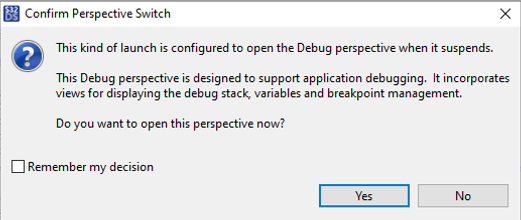

# Exercise 8 - FlexRay

The goal of this excercise is to use the GDB command line debugger to be debug a FLEX CAN Application. The following FLEX CAN application should be downloaded and installed on an MPC5748G development board.

* [EXERCISE 8 - FLEX CAN Bus Application]()

On the Windows PC connected to the  MPC5748G development board, via a USB connection, running the [EXERCISE 8 - FLEX CAN Bus Application]() and S32DS compile and download the application to the MPC5748G development board. Once this has been achieved, click the debug button in the S32DS environment. This will produce the following windows. In this windows you should click the NO button.

Once toy hace done this is a separate windows you can use GNU GDB Debugger. 

## Contact Details

For further information and questions please contact Dr Andrew Blyth, PhD. <ablyth@merimetso.net>
